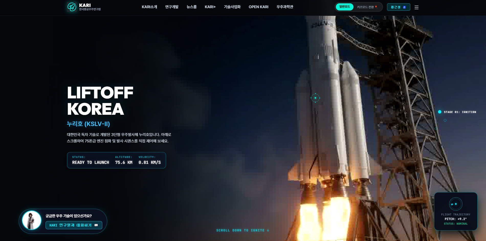
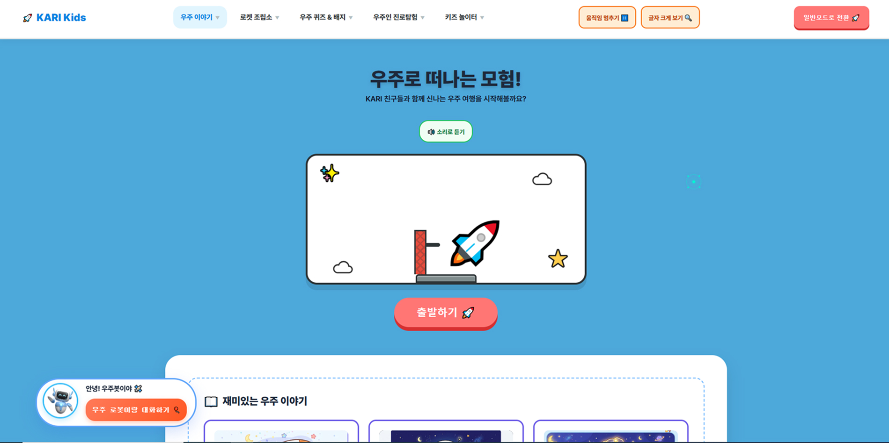
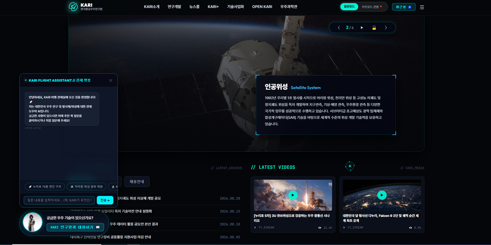
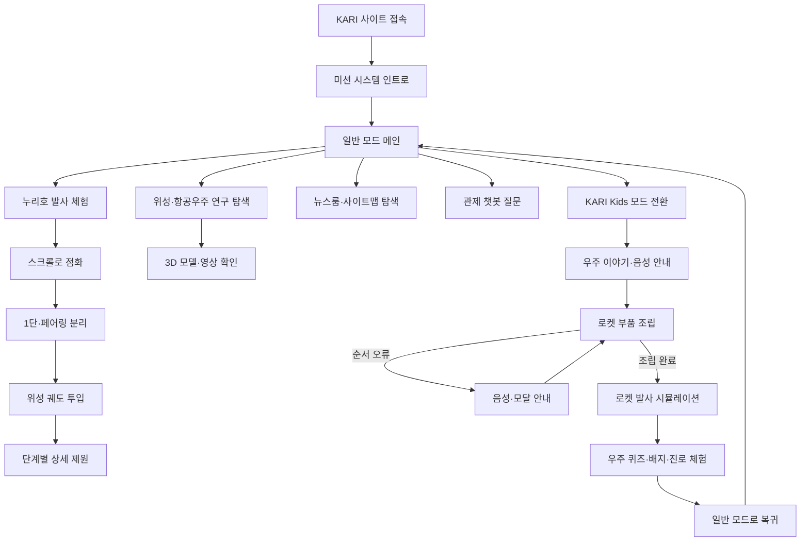
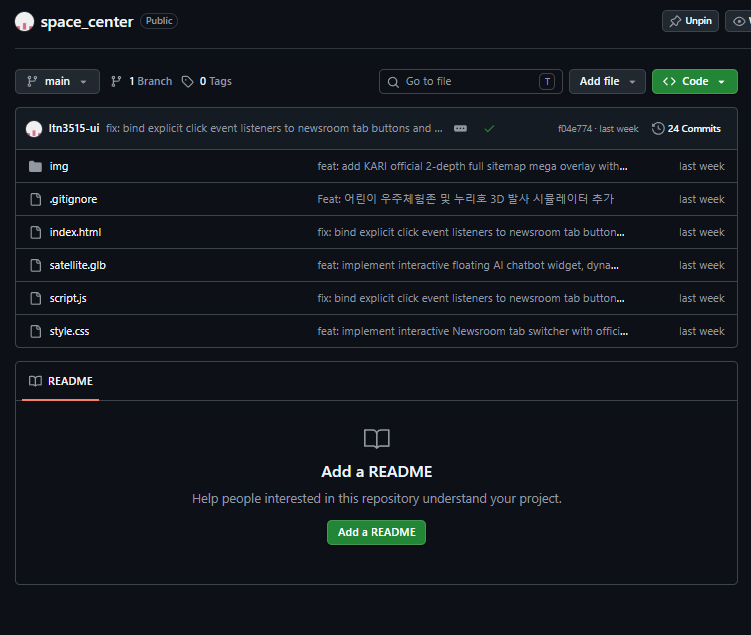

# 🚀 KARI Space Center — 한국항공우주연구원 인터랙티브 리뉴얼

> 전문적인 항공우주 정보를 몰입형 발사 체험과 어린이 우주교육 콘텐츠로 재구성한 KARI 웹사이트 리뉴얼 프로젝트

<p>
  
  
  
  
  
  
</p>

## 🔗 프로젝트 링크

| 구분 | 링크 |
|---|---|
| 🚀 배포 페이지 | [ltn3515-ui.github.io/space_center](https://ltn3515-ui.github.io/space_center) |
| 📦 Deployments | [GitHub Deployments](https://github.com/ltn3515-ui/space_center/deployments) |
| 💻 GitHub | [ltn3515-ui/space_center](https://github.com/ltn3515-ui/space_center) |
| 📝 Notion 기획서 | [KARI 리뉴얼 프로젝트 기획서](https://proud-syrup-039.notion.site/3d406f8b2220805cb394dd6977243451?source=copy_link) |

## 🖼️ 주요 화면

<table>
  <tr>
    <th>누리호 발사 인터랙션</th>
    <th>KARI Kids 우주 체험</th>
    <th>뉴스룸·관제 챗봇</th>
  </tr>
  <tr>
    <td></td>
    <td></td>
    <td></td>
  </tr>
</table>

## 💡 기획 배경

항공우주기관의 웹사이트에는 연구 성과, 발사체, 위성, 기술사업화와 교육자료 등 많은 정보가 담겨 있습니다. 하지만 전문 용어와 방대한 메뉴 때문에 일반 사용자와 어린이가 원하는 정보를 이해하고 탐색하기 어렵습니다.

이 프로젝트는 KARI의 전문성을 유지하면서도 사용자가 누리호 발사 과정과 위성 기술을 직접 체험하고, 어린이는 놀이와 음성 안내를 통해 우주과학을 배울 수 있도록 리뉴얼한 인터랙티브 웹 프로젝트입니다.

### 핵심 문제

- 전문적인 항공우주 정보의 진입 장벽이 높습니다.
- 텍스트 중심 콘텐츠만으로 발사 과정과 우주기술을 이해하기 어렵습니다.
- 일반 사용자와 어린이에게 동일한 정보 구조를 제공하면 난이도 조절이 어렵습니다.
- 많은 메뉴와 연구자료를 빠르게 찾기 어렵습니다.

### 해결 방향

`인트로 → 일반/어린이 모드 선택 → 발사·위성 체험 → 상세 정보 탐색 → 챗봇 질문`으로 이어지는 참여형 학습 경험을 설계했습니다.

## ✨ 주요 기능 & 인터랙션

### 1. 누리호 스크롤 발사 시퀀스

스크롤 진행률에 맞춰 누리호 발사 장면이 움직이는 이미지 시퀀스 인터랙션을 구현했습니다. 200장의 프레임을 Canvas에 순차적으로 렌더링하고 GSAP ScrollTrigger로 점화, 단 분리와 궤도 투입 단계를 제어합니다.

### 2. 실시간 비행 데이터와 미션 타임라인

스크롤 위치에 따라 고도, 속도, 비행 상태와 미션 단계가 변경됩니다. 사용자는 화면 우측의 단계 표시와 상세 모달을 통해 75톤급 엔진 점화, 1단·페어링 분리, 위성 궤도 투입 과정을 확인할 수 있습니다.

### 3. 일반 모드와 KARI Kids 모드

전문 정보를 제공하는 일반 모드와 어린이 눈높이의 KARI Kids 모드를 분리했습니다. 모드 변경 시 Canvas로 구현한 워프 전환 효과가 재생되고 색상, 캐릭터, 콘텐츠와 챗봇 질문이 함께 변경됩니다.

### 4. 어린이 로켓 조립·발사 체험

부스터, 연료 탱크, 페이로드와 페어링을 올바른 순서로 조립하는 체험을 제공합니다. 순서가 틀리면 안내 모달과 음성이 나오며, 조립을 완료하면 로켓 발사 애니메이션이 실행됩니다.

### 5. 음성 안내와 접근성 기능

Web Speech API를 활용해 어린이 안내와 오류 메시지를 한국어 음성으로 읽어줍니다. 일반/키즈 모드 전환, 글자 크게 보기, 키보드 조작과 의미 있는 버튼 레이블을 통해 다양한 사용자의 접근성을 고려했습니다.

### 6. Three.js 기반 우주기술 콘텐츠

Three.js와 GLTFLoader를 활용해 인공위성, 탐사선과 로봇 3D 모델을 웹에서 확인할 수 있도록 구성했습니다. 정적인 설명 대신 회전 가능한 오브젝트와 영상·이미지 콘텐츠를 함께 제공합니다.

### 7. 뉴스룸과 전체 사이트맵

공지, 보도자료와 영상 콘텐츠를 탭으로 구분하고 사용자 선택에 따라 목록을 전환합니다. KARI 소개, 연구개발, 뉴스룸, 기술사업화, OPEN KARI와 우주과학관으로 이어지는 2단계 전체 사이트맵도 제공합니다.

### 8. KARI 관제 챗봇

누리호 엔진, 아리랑 위성과 차세대 발사체 등 추천 질문을 선택하거나 직접 질문할 수 있는 관제 챗봇 UI를 구성했습니다. 현재 버전은 미리 정의된 지식 응답과 인터랙션 중심이며, 실제 생성형 AI·검색 API 연동은 향후 확장 항목입니다.

## 🧭 사용자 플로우



## 🗂️ 폴더 구조

```text
space_center/
├── img/
│   ├── nuri_frames/                  # 누리호 스크롤 애니메이션 200프레임
│   │   ├── ezgif-frame-001.jpg
│   │   ├── ...
│   │   └── ezgif-frame-200.jpg
│   ├── sat_frames/                   # 위성 이미지 시퀀스 프레임
│   ├── Cassini-Huygens (A).glb       # 카시니-하위헌스 3D 모델
│   ├── Mars Global Surveyor.glb      # 화성 탐사선 3D 모델
│   ├── Voyager Probe (A).glb         # 보이저 탐사선 3D 모델
│   ├── robot.glb                     # 어린이 모드 로봇 3D 모델
│   ├── nuri.mp4                      # 누리호 영상
│   ├── aircraft.mp4                  # 항공기 영상
│   ├── galuxy.mp4                    # 우주 배경 영상
│   └── *.jpg · *.png                 # 로고·연구·우주교육 이미지
├── satellite.glb                     # 인공위성 메인 3D 모델
├── index.html                        # 전체 화면·콘텐츠·모달 구조
├── style.css                         # 반응형·일반/키즈 테마·애니메이션
├── script.js                         # GSAP·Canvas·3D·챗봇·TTS 인터랙션
└── .gitignore                        # Git 추적 제외 설정
```

<details>
  <summary><strong>GitHub 저장소 구조 캡처 보기</strong></summary>
  <br />
  
</details>

## 🛠️ 기술 스택

| 구분 | 기술 | 활용 내용 |
|---|---|---|
| Markup | HTML5 | 시맨틱 콘텐츠·모달·일반/키즈 화면 구조 |
| Styling | CSS3 | 반응형 레이아웃·테마·전환 애니메이션 |
| Interaction | JavaScript | 탭·모달·챗봇·게임·접근성 상태 제어 |
| Motion | GSAP 3, ScrollTrigger | 스크롤 기반 발사 시퀀스와 섹션 연출 |
| Rendering | Canvas API | 누리호 프레임과 워프 효과 렌더링 |
| 3D | Three.js r128, GLTFLoader | 위성·탐사선·로봇 GLB 모델 표시 |
| Accessibility | Web Speech API | 한국어 음성 안내와 TTS |
| Deploy | GitHub Pages | 정적 웹사이트 배포 |

## 🤖 AI 활용 프로세스

이 프로젝트는 KARI의 복잡한 정보를 사용자 친화적인 인터랙션으로 바꾸는 과정에서 AI를 기획·콘텐츠·디자인·개발 보조 도구로 활용했습니다. AI 결과는 실제 코드와 화면에서 검증하고 직접 수정했습니다.

### ① 리서치·기획 — 정보 구조 재설계

KARI의 연구개발, 발사체, 위성, 뉴스와 교육 콘텐츠를 사용자 목적별로 분류하고 일반 사용자와 어린이의 탐색 흐름을 나누는 데 AI를 활용했습니다.

> “항공우주기관의 전문 정보를 일반 사용자와 어린이가 쉽게 탐색할 수 있도록 정보 구조와 핵심 사용자 플로우를 나눠줘.”

AI가 정리한 초안에서 중복되는 메뉴를 줄이고, `일반 모드의 전문성`과 `키즈 모드의 체험성`이 명확히 구분되도록 직접 재구성했습니다.

### ② 콘텐츠 — 전문 용어의 난이도 조절

누리호 엔진, 단 분리와 위성 궤도 투입 과정을 단계별 설명으로 정리하고, 어린이 콘텐츠에서는 같은 내용을 쉬운 말과 퀴즈·조립 활동으로 바꾸는 데 AI를 활용했습니다. 수치와 고유 정보는 별도로 확인해 화면에 반영했습니다.

### ③ UX/UI — 두 가지 테마와 인터랙션 설계

일반 모드는 관제실의 어두운 네이비·시안 컬러, 어린이 모드는 밝은 하늘색과 코랄 컬러로 분리했습니다. AI로 화면별 분위기와 인터랙션 아이디어를 탐색한 뒤, 최종 레이아웃과 디자인 시스템은 직접 조정했습니다.

### ④ 개발 — GSAP·Canvas·Three.js 코드 초안

스크롤 진행률을 프레임 번호로 변환하는 Canvas 렌더링, 미션 단계 전환, Three.js 모델 로더와 키즈 모드 게임 로직의 초안을 AI 바이브코딩으로 제작했습니다.

> “스크롤 비율에 따라 200장의 이미지 프레임을 Canvas에 그리는 구조와 GSAP ScrollTrigger 제어 로직을 만들어줘.”

AI가 만든 초기 코드에서 이미지 동시 로딩으로 발생한 지연, 모바일 화면 비율과 이벤트 중복을 확인하고 프리로드·렌더 순서·이벤트 바인딩을 직접 수정했습니다.

### ⑤ 접근성 — TTS와 키보드 사용성

어린이와 읽기 지원이 필요한 사용자를 위해 Web Speech API 기반 음성 안내를 적용하고, 버튼 레이블과 키보드 조작 흐름을 점검하는 데 AI 체크리스트를 활용했습니다.

### ⑥ 챗봇 — 질문 흐름과 답변 구조

관제 챗봇의 추천 질문과 답변 문구를 구성하는 데 AI를 활용했습니다. 현재는 프론트엔드에 준비된 지식 응답을 제공하며, 향후 KARI 데이터 검색과 생성형 AI API를 연결할 수 있도록 확장 방향을 설계했습니다.

## 🩹 트러블슈팅

| 이슈 | 원인 | 해결 |
|---|---|---|
| 첫 접속 시 프레임 애니메이션이 늦게 표시됨 | 고해상도 이미지 다량 동시 로드 | 프레임 사전 로드와 현재 프레임 우선 렌더링 적용 |
| 새로고침 후 중간 스크롤에서 시작됨 | 브라우저의 자동 스크롤 위치 복원 | `scrollRestoration` 비활성화 후 초기 위치와 ScrollTrigger 갱신 |
| 모바일에서 누리호 이미지 비율이 깨짐 | Canvas 크기와 원본 비율 계산 불일치 | 화면 크기에 따른 cover 렌더링 좌표 재계산 |
| 뉴스룸 탭 일부가 클릭되지 않음 | 동적 요소와 이벤트 대상 불일치 | 각 탭 버튼에 명시적인 클릭 이벤트를 바인딩 |
| 키즈 모드 로켓 조립 순서가 반영되지 않음 | 부품 상태와 DOM 상태가 분리됨 | 설치 여부 Map과 현재 단계 값을 함께 갱신 |
| Three.js 모델 로딩 중 화면이 멈춘 것처럼 보임 | 대용량 GLB 로딩 상태 안내 부족 | 로딩 상태와 대체 이미지·오류 처리를 분리 |

## 🚀 로컬 실행 방법

이 프로젝트는 정적 웹사이트이므로 별도의 패키지 설치 없이 실행할 수 있습니다. GLB 모델과 일부 브라우저 기능을 안정적으로 사용하려면 로컬 서버에서 실행하는 것을 권장합니다.

```bash
# 저장소 복제
git clone https://github.com/ltn3515-ui/space_center.git

# 프로젝트 폴더 이동
cd space_center

# VS Code Live Server 또는 간단한 로컬 서버 실행
python -m http.server 5500
```

브라우저에서 `http://localhost:5500`으로 접속합니다.

## 📌 향후 개선 계획

- 실제 KARI 공개 데이터 API와 뉴스 자동 연동
- 생성형 AI와 검색 데이터를 연결한 관제 챗봇
- 3D 모델의 키보드·터치 조작 및 대체 설명 강화
- 이미지 프레임을 WebP·AVIF 또는 영상으로 최적화
- 키즈 모드의 퀴즈 점수·배지 저장 기능
- 모바일 저사양 기기를 위한 경량 모드 제공

## 👤 담당 업무

- 기존 사이트 분석과 리뉴얼 콘셉트 기획
- 일반·어린이 사용자 플로우 및 UI 디자인
- HTML·CSS·JavaScript 퍼블리싱
- GSAP·Canvas 기반 누리호 발사 인터랙션
- Three.js 3D 콘텐츠와 Web Speech API 적용
- AI 바이브코딩을 활용한 코드 생성·검증·트러블슈팅
- GitHub 형상관리와 GitHub Pages 배포

## 📄 라이선스

본 프로젝트는 포트폴리오 및 학습 목적으로 제작한 비공식 KARI 리뉴얼 프로젝트입니다. 한국항공우주연구원의 공식 웹사이트가 아닙니다.
